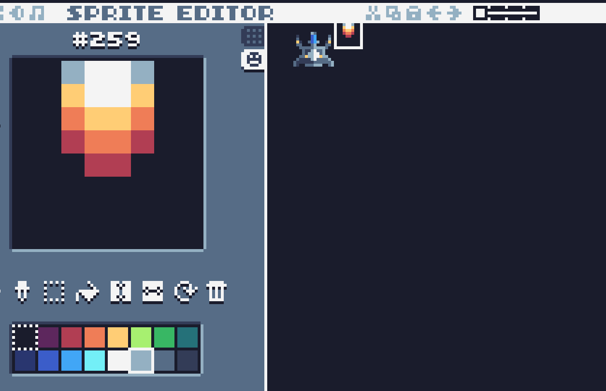

#### Huw Lloyd, Manchester Metropolitan University

In this exercise, we will use the __Tic-80__ *fantasy console* to create a simple game, or at least the beginnings of a game that you can continue to develop. Tic 80 is free, open source, and doesn't even need to be installed; you can use it entirely in a browser. You can program Tic-80 in a range of different languages, including _Lua_, _Wren_ and _Javascript_. We will use Javascript.

# Step 1: Setup

If you are at the visit day, this step will be demonstrated on the screen, so you don't need to read all of this. It's much quicker to show it than to describe it.

1) First, fire up Tic80. Do this by going to [https://tic80.com/create](https://tic80.com/create) and clicking on the window which says 'click to play'. You should see the Tic-80 _console_ window appear, see below.


2) The first thing to try is to type __RUN__ and hit return, which should take you into the default game:


3) Use the arrow keys to move the character around. Then hit the __ESC__ key to return to the console. When running a game, you can always go back to the console by hitting __ESC__.

4) Now, when you are in the console, hit __ESC__ again. You should be taken from the console to the _editor_ (see below). By default, this takes you to the __code__ editor. You can also access other editors such as the __sprite__, __map__ and __SFX__ editors using the small row of icons at the top left of the screen. We will only use the code and sprite editors in this tutorial. The picture below should help you through the next few steps.


5) We need to clear out the code for the default game and switch the project to Javascript. To do this, go to the code editor, select all the code and delete it (using the __DEL__ key) and type in this Javascript code instead.

```js
// title:  visit day
// author: you
// desc:   a quick tic-80 game
// script: js

function TIC()
{
   // this code is run once every screen refresh
   cls() // clear the screen
}
```
6) Now to clear out the sprite sheet. Switch to the sprite editor, and following the picture above, set the view and tool sizes so that you can quickly clear out the sprite with the pencil tool. The window on the left is where you can make changes, the window on the right shows the entire _spritesheet_. This is where all the sprites for a game are stored in one big image. Make sure the colour is set to black from the palette, and scrub out the sprites with the pencil tool. When you are done, move the sliders back to the left and bottom respectively.

You can see the steps for part 1 in this video:

<iframe id="kaltura_player" src="https://cdnapisec.kaltura.com/p/1128062/sp/112806200/embedIframeJs/uiconf_id/27474902/partner_id/1128062?iframeembed=true&playerId=kaltura_player&entry_id=1_it4ahr9h&flashvars[akamaiHD.loadingPolicy]=preInitialize&amp;flashvars[akamaiHD.asyncInit]=true&amp;flashvars[streamerType]=hdnetwork&amp;flashvars[localizationCode]=en&amp;flashvars[hotspots.plugin]=1&amp;flashvars[Kaltura.addCrossoriginToIframe]=true&amp;&wid=1_ujtewgd1" width="800" height="529" allowfullscreen webkitallowfullscreen mozAllowFullScreen allow="autoplay *; fullscreen *; encrypted-media *" sandbox="allow-forms allow-same-origin allow-scripts allow-top-navigation allow-pointer-lock allow-popups allow-modals allow-orientation-lock allow-popups-to-escape-sandbox allow-presentation allow-top-navigation-by-user-activation" frameborder="0" title="Kaltura Player"></iframe>


# Step 2: Starry background

1) First, we will add an __array__ for the stars, and populate it with random points in the 240x136 screen. Copy the code below, and add it to the code in the code editor. There is a new version of the __TIC()__ function here. Either replace the old one, or work out what has changed and update it with the changes.  

```js
stars = []

function CreateStars()
{
   numStars = 200
   for ( i = 0; i < numStars; i++ )
   {
       stars.push( {x: 240*Math.random(), y:136*Math.random()} )
   }
}

function TIC()
{
   if ( stars.length == 0 )
   {
      CreateStars()
   }
   cls()
}
```

There is quite a lot going on here. We have used an __array__ called _stars_ (denoted by square brackets) to store multiple __objects__. We use __push__ to add a new object to the end of the array. An object, which is denoted by curly brackets, is a way of storing multiple values in one place. The values have names, which go before the colon (:) and values which come after the colon. Finally there is a __for__ loop, which is a way of repeating the same code multiple times - in this case 200 times (which is controlled by the __variable__ numStars). 

2) Now to draw the stars. Add the following code for a new function, called __DrawStars__, between the __CreateStars__ and __TIC__ functions. We use the __pix__ function to draw a single pixel for each star.

```js
function DrawStars( )
{
   for ( i = 0; i < stars.length; i++ )
   {
      pix(stars[i].x, stars[i].y, 12) // colour 12 is white
   }
}
```

3) Now change the __TIC__ function so that it _calls_ DrawStars, after __cls()__.

```js
function TIC()
{
   if ( stars.length == 0 )
   {
      CreateStars()
   }
   cls()
   DrawStars() 
}
```
4) Try running the game. You should see a fixed, starry background, like this:


Step 2 is covered in this video:

<iframe id="kaltura_player" src="https://cdnapisec.kaltura.com/p/1128062/sp/112806200/embedIframeJs/uiconf_id/27474902/partner_id/1128062?iframeembed=true&playerId=kaltura_player&entry_id=1_bpaiokfs&flashvars[akamaiHD.loadingPolicy]=preInitialize&amp;flashvars[akamaiHD.asyncInit]=true&amp;flashvars[streamerType]=hdnetwork&amp;flashvars[localizationCode]=en&amp;flashvars[hotspots.plugin]=1&amp;flashvars[Kaltura.addCrossoriginToIframe]=true&amp;&wid=1_qwqheyig" width="800" height="529" allowfullscreen webkitallowfullscreen mozAllowFullScreen allow="autoplay *; fullscreen *; encrypted-media *" sandbox="allow-forms allow-same-origin allow-scripts allow-top-navigation allow-pointer-lock allow-popups allow-modals allow-orientation-lock allow-popups-to-escape-sandbox allow-presentation allow-top-navigation-by-user-activation" frameborder="0" title="Kaltura Player"></iframe>

# Step 3: Scrolling stars

The next step is to make the stars scroll vertically. We do this in two parts. In the first part, we add a time __variable__, and pass it in to the DrawStars function as a __parameter__, then use this time variable to offset the y coordinate of each star.

1) First change the __DrawStars__ function to this new version.

```js
function DrawStars( offset )
{
   for ( i = 0; i < stars.length; i++ )
   {
      pix(stars[i].x, stars[i].y + offset, 12)
   }
}
```

2) Now, below __DrawStars__ in the code, add a new variable called __time__, and modify __TIC()__ as shown so that __time__ is __incremented__ each update, and the value of time is passed to the DrawStars function as a parameter

```js
time = 0

function TIC()
{
   if ( stars.length == 0 )
   {
      CreateStars();
   }
   time += 1;
   cls();
   DrawStars( time );
}
```

This works, but the stars fall off the bottom of the screen. There is a trick we can use to fix this - the __modulo__ operator, __%__. What this does is give the remainder after division. If we replace the __y__ coordinate of a star with __y%136__, then as soon as a star goes off the screen (its y coordinate is greater than 136) the modulo operator will wrap it back around to zero.

3) Look at this code, compare it to what you have, and work out the changes you need to make to include the modulo operator.
```js
function DrawStars( offset )
{
   for ( i = 0; i < stars.length; i++ )
   {
      pix(stars[i].x, (stars[i].y + offset)%136, 12)
   }
}
```

Your stars should now scroll by for ever, without falling off the bottom of the screen.

Step 3 is covered in this video:

<iframe id="kaltura_player" src="https://cdnapisec.kaltura.com/p/1128062/sp/112806200/embedIframeJs/uiconf_id/27474902/partner_id/1128062?iframeembed=true&playerId=kaltura_player&entry_id=1_evvv24f3&flashvars[akamaiHD.loadingPolicy]=preInitialize&amp;flashvars[akamaiHD.asyncInit]=true&amp;flashvars[streamerType]=hdnetwork&amp;flashvars[localizationCode]=en&amp;flashvars[hotspots.plugin]=1&amp;flashvars[Kaltura.addCrossoriginToIframe]=true&amp;&wid=1_c8385nrj" width="800" height="529" allowfullscreen webkitallowfullscreen mozAllowFullScreen allow="autoplay *; fullscreen *; encrypted-media *" sandbox="allow-forms allow-same-origin allow-scripts allow-top-navigation allow-pointer-lock allow-popups allow-modals allow-orientation-lock allow-popups-to-escape-sandbox allow-presentation allow-top-navigation-by-user-activation" frameborder="0" title="Kaltura Player"></iframe>

## Challenge Exercises (solution at the end)

1) Try to slow the stars down, or speed them up. Hint: look at the line __time += 1__ and think about what you would need to do to make the variable change at half the speed.

2) Make some of the stars a different colour (e.g. 13, which is a greyish colour). Suggested method: add another member to the star object, called colour, and set this randomly to 12 or 13. Use this value instead of the fixed value 12 when drawing the stars..

# Step 4: Adding a Ship

1)  Make a ship sprite using the sprite editor. This should be 16x16 pixels, and should be in the same position in the sprite sheet as in the picture below. The slider at the top will need be moved one notch along to work in 16x16. Use the palette to choose colours and the pencil tool to draw pixels. There is no eraser, just draw over any pixels you get wrong. You can design your own ship.


2) Now add some code do draw it. First we add some variables for the ship position, just below the time variable

```js
shipx = 110
shipy = 110
```

3) Now we add a line of code in __TIC()__, just after the call to DrawStars()

```js
   spr( 257, shipx, shipy, 0, 1, 0, 0, 2, 2)
```

> Note: 257 is the index of the sprite in the sprite sheet. __shipx__ and __shipy__ are the x and y coordinates of the ship. The other numbers here control things like the scale, rotation and so on. You can look them all up [here](https://github.com/nesbox/TIC-80/wiki/spr)

4) Next up are some controls. Add the following code in __TIC()__. You can put this anywhere inside __TIC()__, it's best to put it before the code that draws the ship.

```js
   if ( btn(3) && shipx < 224 )
      shipx += 1
   if ( btn(2) && shipx > 0)
      shipx -= 1
```

> This code does two things: first it checks the button presses and updates the ship position if the left or right arrow keys are pressed. Secondly, it stops the ship going off the screen if the x position is out of range - the __&&__ means 'and', so the __if__ statements are each checking that two conditions are true.

5) Try running the game now. You should be able to move the ship from side to side using the arrow keys.

Step 4 is covered here:

<iframe id="kaltura_player" src="https://cdnapisec.kaltura.com/p/1128062/sp/112806200/embedIframeJs/uiconf_id/27474902/partner_id/1128062?iframeembed=true&playerId=kaltura_player&entry_id=1_f3rx2g7d&flashvars[akamaiHD.loadingPolicy]=preInitialize&amp;flashvars[akamaiHD.asyncInit]=true&amp;flashvars[streamerType]=hdnetwork&amp;flashvars[localizationCode]=en&amp;flashvars[hotspots.plugin]=1&amp;flashvars[Kaltura.addCrossoriginToIframe]=true&amp;&wid=1_tvdokvbw" width="800" height="529" allowfullscreen webkitallowfullscreen mozAllowFullScreen allow="autoplay *; fullscreen *; encrypted-media *" sandbox="allow-forms allow-same-origin allow-scripts allow-top-navigation allow-pointer-lock allow-popups allow-modals allow-orientation-lock allow-popups-to-escape-sandbox allow-presentation allow-top-navigation-by-user-activation" frameborder="0" title="Kaltura Player"></iframe>


# Step 5: Shooting

Finally we will add the ability to shoot. We will use similar ideas to the star system - an array of objects, where each object represents one of the bullets. The difference is that we now have a dynamic situation which is updated every frame, rather than set up once at the beginning.

1) First, make a sprite for the bullet. This needs to be a single 8x8 sprite, next to the ship in the sprite sheet (this is sprite number 259). See below for an example



2) Now, back in the code editor, add a new array, called __bullets__. Add this to the code directly after the __stars__ array.

```js 
// after the stars array
bullets = []
```

3) Next we will add some code to the __TIC()__ function which checks for presses on the __X__ button (which is button 5 on Tic-80) and adds a bullet to the array if a button press is detected. You should add this code just after the code for controlling the ship.
```js
// in TIC(), after the other control code
   if ( btnp(5) )
   {
      bullet = {x:shipx+4, y:shipy-2}
      bullets.push(bullet)
   }
```
4) Finally, we will add some code to draw the bullets and move them. Notice how this code draws each bullet using the __spr__ command, then changes its __y__ value so that it moves up the screen. Add this code at the end of the __TIC()__ function (before the final curly bracket).

```js
// at the end of TIC()
   // draw bullets
   for ( i = 0; i < bullets.length; i++ )
   {
      spr(259, bullets[i].x, bullets[i].y, 0 )
      bullets[i].y -= 1
   }
```

* Your game should now look like this.


## Finally...

There is an issue with this; the bullet array keeps getting bigger and bigger because we add bullets but never remove them. We could fix this by removing bullets which have travelled off the top of the screen. You could do this by adding the following two lines of code just before the __for__ loop which updates and draws the bullets. The __shift__ function takes the first element of an array, discards it and shifts everything down one. Note this only checks the first element of the array, but only one bullet can go off screen at a time, and it is always the first one in the array.

```js
   if (bullets.length > 0 && bullets[0].y < -8 )
      bullets.shift()
```

If you want to demonstrate that this works, add this to the end of __TIC()__ to show the number of bullets on the screen.

```js
   print(""+bullets.length, 0, 0)
```
Here is a video of Step 5:

<iframe id="kaltura_player" src="https://cdnapisec.kaltura.com/p/1128062/sp/112806200/embedIframeJs/uiconf_id/27474902/partner_id/1128062?iframeembed=true&playerId=kaltura_player&entry_id=1_lxqe81c3&flashvars[akamaiHD.loadingPolicy]=preInitialize&amp;flashvars[akamaiHD.asyncInit]=true&amp;flashvars[streamerType]=hdnetwork&amp;flashvars[localizationCode]=en&amp;flashvars[hotspots.plugin]=1&amp;flashvars[Kaltura.addCrossoriginToIframe]=true&amp;&wid=1_oxl6le0f" width="800" height="529" allowfullscreen webkitallowfullscreen mozAllowFullScreen allow="autoplay *; fullscreen *; encrypted-media *" sandbox="allow-forms allow-same-origin allow-scripts allow-top-navigation allow-pointer-lock allow-popups allow-modals allow-orientation-lock allow-popups-to-escape-sandbox allow-presentation allow-top-navigation-by-user-activation" frameborder="0" title="Kaltura Player"></iframe>

# Challenge Exercise Solutions

1) To slow the bullets down by a factor two, replace 

```js
   time += 1;
```

with


```js
   time += 0.5;
```

You can speed them up by using a number greater than 1.

2) Replace CreateStars and DrawStars with these versions.

```js
function CreateStars()
{
   numStars = 200
   for ( i = 0; i < numStars; i++ )
   {
      if ( Math.random() < 0.5 )
    	 colour = 12
      else
    	 colour = 13
      stars.push( {x: 240*Math.random(), y:136*Math.random(), colour:colour} )
   }
}

function DrawStars( offset )
{
   for ( i = 0; i < stars.length; i++ )
   {
      pix(stars[i].x, (stars[i].y + offset)%136, stars[i].colour)
   }
}
```
Solutions are explained in this video

<iframe id="kaltura_player" src="https://cdnapisec.kaltura.com/p/1128062/sp/112806200/embedIframeJs/uiconf_id/27474902/partner_id/1128062?iframeembed=true&playerId=kaltura_player&entry_id=1_3eser5r7&flashvars[akamaiHD.loadingPolicy]=preInitialize&amp;flashvars[akamaiHD.asyncInit]=true&amp;flashvars[streamerType]=hdnetwork&amp;flashvars[localizationCode]=en&amp;flashvars[hotspots.plugin]=1&amp;flashvars[Kaltura.addCrossoriginToIframe]=true&amp;&wid=1_0io9coqn" width="800" height="529" allowfullscreen webkitallowfullscreen mozAllowFullScreen allow="autoplay *; fullscreen *; encrypted-media *" sandbox="allow-forms allow-same-origin allow-scripts allow-top-navigation allow-pointer-lock allow-popups allow-modals allow-orientation-lock allow-popups-to-escape-sandbox allow-presentation allow-top-navigation-by-user-activation" frameborder="0" title="Kaltura Player"></iframe>
